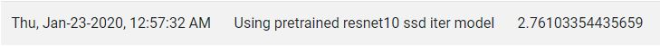
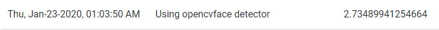
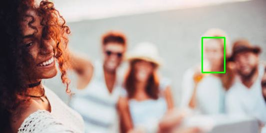
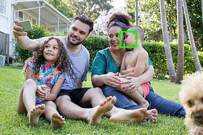
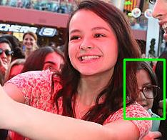
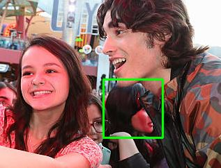
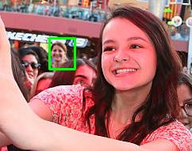
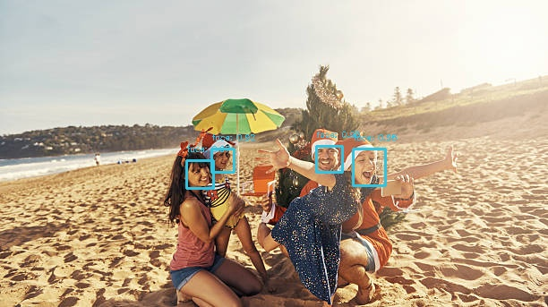

# Face Counting Challenge - 2nd rank - Active competition - Analytics Vidhya Hackathon

Link - https://datahack.analyticsvidhya.com/contest/vista-codefest-computer-vision-1/

#### Problem Statement
People detection and head counting is one of the classical albeit challenging computer vision application. For this problem, given a group selfie/photo, you are required to count the number of heads present in the picture. You are provided with a training set of images with coordinates of bounding box and head count for each image and need to predict the headcount for each image in the test set.

#### Evaluation Metric
The evaluation metric for this competition is RMSE (root mean squared error) over the head counts predicted for test images.

#### Train and test data
Under Problem Statement section - https://datahack.analyticsvidhya.com/contest/vista-codefest-computer-vision-1/ 
1. train.zip: Contains 2 csvs and 1 folder containing image data
-a. train.csv - ['Name', 'HeadCount'] (contains headcount value for each training image)
-b. bbox_train.csv - ['Name', 'width', 'height' , 'xmin', 'ymin', 'xmax', 'ymax', 'class'] (contains co-ordinates of each head in the ------train image, located by the formation of a bound-box around the head)
2. test.csv - ['Name'] (contains only name of testing images)
3. sample_submission.csv - ['Name', 'HeadCount'] (contains format for a valid submission)

#### Hardware
Cloud instance with GPU (GCP)
GPU -> 4, P100 16GB GPUs
RAM -> 120GB (64GB RAM is minimum to have 4 P100 16GB GPUs in GCP instance). 

#### Framework 
Tensorflow Object Detection API - https://github.com/tensorflow/models

### Journey
Initially I tried with mostly used and popular networks used in OpenCV to make it as base RMSE score.
1. FP16 version of the original caffe implementation (res10_300x300_ssd_iter_140000_fp16.caffemodel)
2. 8 bit Quantized version using Tensorflow (opencv_face_detector_uint8.pb)

Using res10_300x300_ssd_iter_140000_fp16.caffemodel got 2.76 RMSE score

Using opencv_face_detector_uint8.pb got 2.73 RMSE score

Implimentation of above models can be found in faces_count/facecounts2.py (https://github.com/AbhinayReddyYarva/FaceCountingChallenge-AnalyticsVidhya/blob/master/faces_count/facecounts2.py)

To view the images with bounding boxes of training set images please go through the file faces_count/visual.py (https://github.com/AbhinayReddyYarva/FaceCountingChallenge-AnalyticsVidhya/blob/master/faces_count/visual.py) 
When observed the bounding boxes of training dataset there are many faces with blur, side, straight half, side half, small (captured from far). Below are some sameple images with bounding boxes. 

Model res10_300x300_ssd_iter_140000_fp16.caffemodel and opencv_face_detector_uint8.pb will work well if face is near to camera but will not work well on half face or blur or small.

As observed from images it looks like bounding box sizes are varying from very small to large, so thought to use Faster RCNN network than other networks like SSD, Yolo or RetinaNet because RPN tends to give good results for smaller objects and also we get more proposals for bounding boxes. Even other networks also can get similar accuracy more inference speed. To use faster RCNN model as inference model we can go for quantization tecnique for 16FLOP or 8FLOP and also can train with architecture pruning once after reaching maximum accuracy.

One sample image with predicted bounding boxes.

